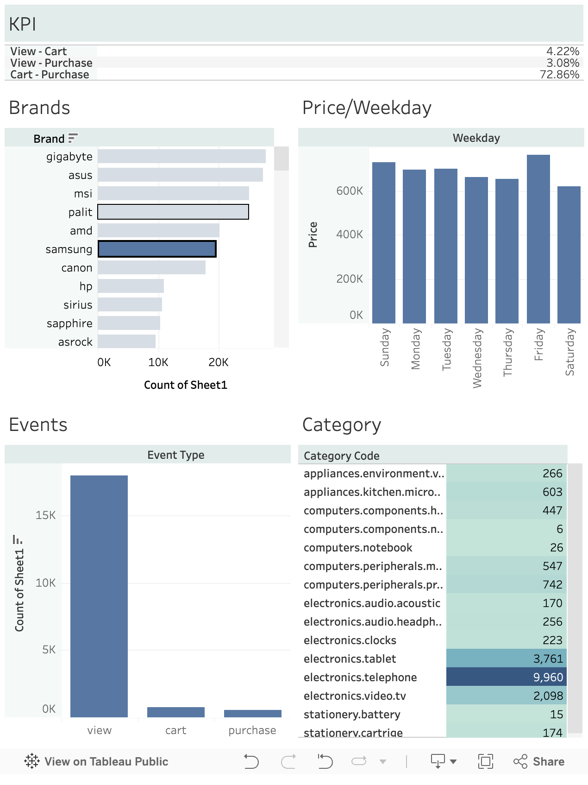

# E-commerce Customer Behavior Analysis

## Project Overview

This project analyzes customer activity data from an electronics e-commerce store. It focuses on how customers interact with products through views, cart additions, and purchases. The goal is to understand buying behavior and find areas where sales performance can be improved.

## Objectives

* Study customer actions during the shopping process
* Calculate conversion rates at different stages
* Find popular products and categories
* Identify where users drop off before purchasing

## Project Links

* 📊 **Tableau Dashboard:** [View Live Dashboard](https://public.tableau.com/app/profile/sachin.sharma3846/viz/E-commerceCustomerBehaviorAnalysis_17757606388860/Dashboard1)
* 📁 **Dataset:** [Kaggle - E-commerce Events History](https://www.kaggle.com/datasets/mkechinov/ecommerce-events-history-in-electronics-store)
* 🎨 **Presentation:** `presentation/project_presentation.pdf`

## Dashboard Preview

## Tools Used

* **Tableau Public** — Dashboard creation and charts
* **Google Colab** — Data cleaning and visualization
* **Excel / CSV** — Data preperation
* **Kaggle** — Dataset source
* **Canva** — Presentation slides
* **GitHub** — Project hosting

## KPI Metrics Analyzed

* Total Views
* Total Cart Adds
* Total Purchases
* View to Cart Conversion Rate
* Cart to Purchase Conversion Rate
* Overall Conversion Rate
* Top Categories
* Top Products

## Key Insights

* Many users viewed products, but fewer added items to cart.
* A noticeable drop happened between cart and purchase stage.
* Some products received much higher engagement than others.
* Funnel optimization can increase revenue without increasing traffic.

